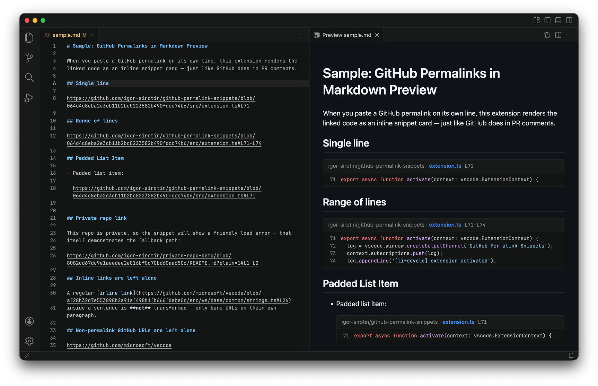

# GitHub Permalink Snippets

Render GitHub permalinks as real code snippets in the VS Code Markdown preview.



> [!NOTE]
> Sign in with GitHub before using the extension: \
> Run `GitHub Permalink Snippets: Sign In with GitHub` from the command palette.

## Quick start

1. Install the extension.
2. Run **GitHub Permalink Snippets: Sign In with GitHub**.
3. Open any Markdown file.
4. Paste a GitHub permalink on its own line.
5. Open **Markdown: Open Preview to the Side**.

The first render may briefly show **Loading...** while the file is fetched. After that, the preview refreshes automatically.

## Why use it

- Preview GitHub permalinks the same way they read in PRs and comments
- Pull code from an exact commit SHA, so snippets stay stable
- Use your GitHub permalinks instead of copying code by hand
- Works with VS Code GitHub auth or a token

## What it supports

| Link type | Example |
| --- | --- |
| Single line | `.../blob/<sha>/<path>#L16` |
| Line range | `.../blob/<sha>/<path>#L20-L35` |
| Whole file | `.../blob/<sha>/<path>` |

Only true permalinks are expanded: the ref must be a 7-40 character commit SHA. Branch and tag URLs stay as normal links.

## Authentication

GitHub sign-in is the recommended setup and the fastest way to get the extension working.

The extension resolves credentials in this order:

1. `githubPermalinkSnippets.githubToken`
2. VS Code GitHub authentication
3. `GITHUB_TOKEN`

If you are not signed in, run **GitHub Permalink Snippets: Sign In with GitHub** from the command palette.

## Commands

| Command | Purpose |
| --- | --- |
| **GitHub Permalink Snippets: Sign In with GitHub** | Sign in to GitHub through VS Code |
| **GitHub Permalink Snippets: Show Log** | Open the extension log |
| **GitHub Permalink Snippets: Clear Snippet Cache** | Clear cached snippet content and refresh preview |

## Notes

- Bare GitHub permalink URLs are expanded into snippets.
- Regular Markdown links like `[label](url)` stay unchanged.
- If loading fails, open **GitHub Permalink Snippets: Show Log** for the GitHub error.

## Development

```bash
npm install
npm run compile
```

Then open the repo in VS Code and press <kbd>F5</kbd>.

## License

MIT
